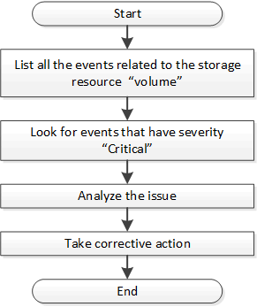

= 使用事件确定存储对象中的问题
:allow-uri-read: 
:icons: font
:imagesdir: ../media/

[role="lead"]
当数据中心中的存储对象超过阈值时，您将收到有关该事件的通知。使用此通知、您可以分析问题描述 并使用采取更正操作 `events` API。

此工作流将卷示例作为资源对象。您可以使用 `events` API用于检索与卷相关的事件列表、分析该卷的严重问题、然后采取更正操作来更正问题描述。

在采取补救措施之前，请按照以下步骤确定卷中的问题。

. 分析数据中心中卷的严重 Active IQ Unified Manager 事件通知。
. 使用中的以下参数查询卷的所有事件 `/management-server/events` API： `"resource_type": "volume"``"severity": "critical"`

[cols="3*"]
|===
| 类别 | HTTP 动词 | 路径 

 a| 
管理服务器
 a| 
获取
 a| 
`/management-server/events`

|===
. 查看输出并分析特定卷中的问题。
. 使用 Unified Manager REST API 或 Web UI 执行必要的操作以解决这些问题。

